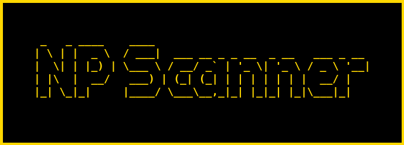
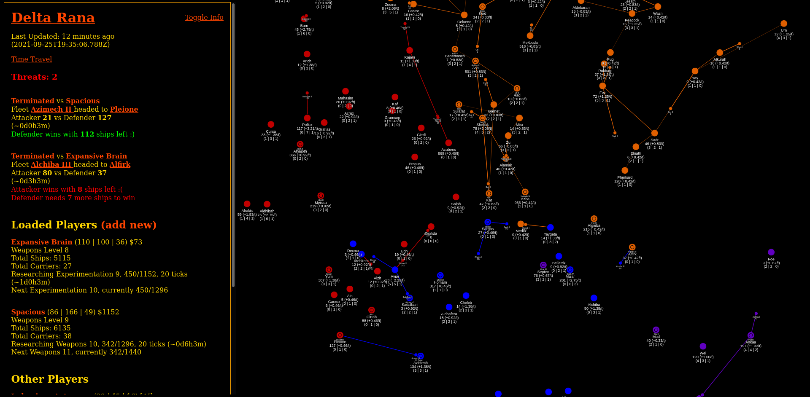
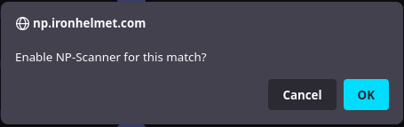
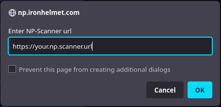
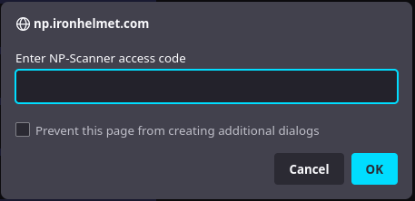
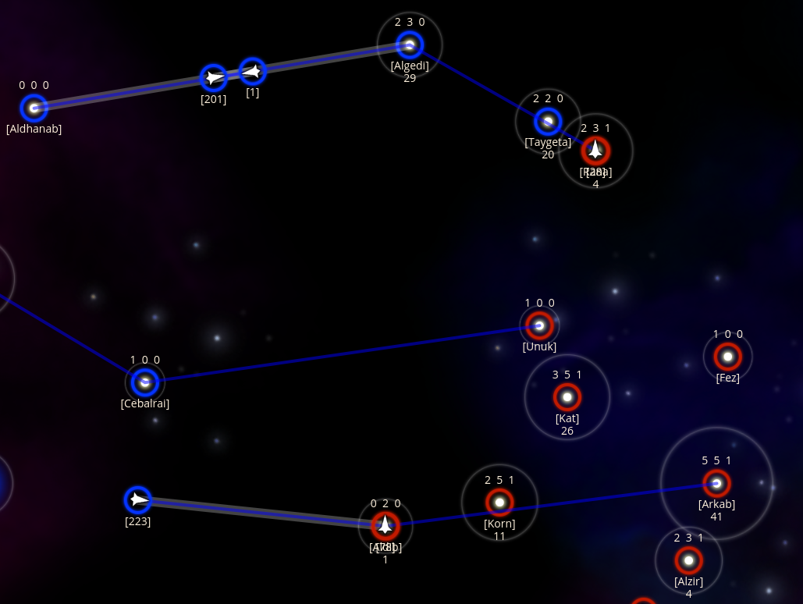

# Scanner for Neptune's Pride

<p align="center">
  
  <p align="center">
    <a href="https://github.com/AlbinoDrought/np-scanner/blob/master/LICENSE"></a>
  </p>
</p>

An unofficial companion site for the game [Neptune's Pride](https://np.ironhelmet.com/) that aids you in calculating battle outcomes and collaborating with allies.

**No support will be given for this project. This is highly experimental. Breaking changes may occur at any time.**

## Screenshots



## Features

- Share scanning data and research targets with other Neptune's Pride players
- Travel through time and view old snapshots of the universe
- Central list of all threats and their categories: red major threats that need immediate action, or green minor threats that are safe to ignore (for now!)
- Early warning system alerts you when a star is targetted
- Data-intensive galaxy map to find high-value target stars

## Usage

1. Add match key: `np-scanner set [game number] [key]`
2. Protect match data with code: `np-scanner protect [game number] [code]`
3. Run the Web UI on 0.0.0.0:38080: `np-scanner serve`

Other commands:

- Help: `np-scanner help`
- Test poll: `np-scanner poll [game number or "all"]`
- Disable match key: `np-scanner disable-player [game number] [player-id]`
- Create a code that can only see data from player 1 and 2: `np-scanner protect --allowed-uid 1 --allowed-uid 2 [game number] [code]`
- Replace all other codes: `np-scanner protect --wipe [game number] [code]`
- Associate a game player with their Discord user ID for notifications: `np-scanner set-discord [game number] [player uid] [discord user id]`

Config:

- Discord Webhook URL for alerts: env var `NP_SCANNER_DISCORD_WEBHOOK_URL=https://...` or cli arg `--discord-webhook-url=https://...`
- DB path (stores match config, snapshots): cli arg `--db-path=/foo/bar.db`
- Notification DB path (stores history of sent notifications): cli arg `--notification-db-path=/foo/bar-notifications.db`

## Building

### With Docker

`docker build -t albinodrought/np-scanner .`

#### Sample Docker Compose

```yml
version: '2'
services:
  np-scanner:
    image: albinodrought/np-scanner
    volumes:
    - /some/local/path:/data
    command:
    - /np-scanner
    - --db-path=/data/np4.db
    - --notification-db-path=/data/np-notifications.db
    - serve
    ports:
      - 38080:38080
```

### Without Docker

You need:

```
git
go
node
npm
make
```

Run `make` to generate an all-inclusive `./dist/np-scanner` binary.

## Userscript

Want to see your allies scanning data on the official map? 

1. Install [the userscript](./NPScannerMapEmbed.user.js) using [Greasemonkey](https://addons.mozilla.org/en-CA/firefox/addon/greasemonkey/) in Firefox, [Violentmonkey](https://chrome.google.com/webstore/detail/violentmonkey/jinjaccalgkegednnccohejagnlnfdag) in Chromium.

2. Visit your Neptune's Pride match on the official site

3. Click "OK" when the `Enable NP-Scanner for this match?` dialog appears:


4. Enter your host and click "OK" when the `Enter NP-Scanner url` dialog appears:


5. Enter your access code and click "OK" when the `Enter NP-Scanner access code` dialog appears:


6. Done! If it worked, your shared scanning data should be loaded. If it didn't work, reset data by adding `#wipe-np-scanner` to the page URL and refresh. If it still doesn't work, try Firefox. If you're already on Firefox, it's probably broken and you'll need to debug it. Good luck. You can open the browser system console with Ctrl-Shift-J to see some Greasemonkey errors that don't show in the regular console.

Injected data will mostly appear in `[square brackets]`:



Userscript only tested in Firefox.

### Android

You can install desktop extensions in Firefox Nightly [by doing a dev-mode dance](https://web.archive.org/web/20211007060220/https://blog.mozilla.org/addons/2020/09/29/expanded-extension-support-in-firefox-for-android-nightly/). If you don't want to make your own collection, I am using [this one](https://addons.mozilla.org/en-US/firefox/collections/17078259/FFAndroidxx/), user ID **17078259** collection name **FFAndroidxx**. Only Violentmonkey worked for me here (Greasemonkey would not install the script, Tampermonkey installed it but nothing happened). 
